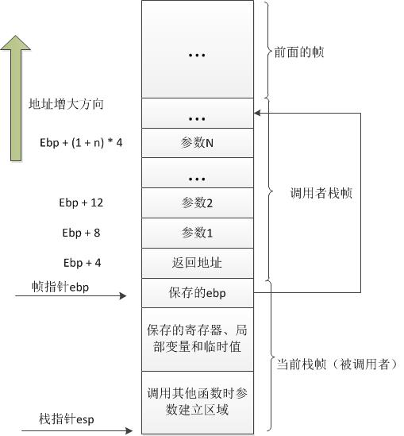
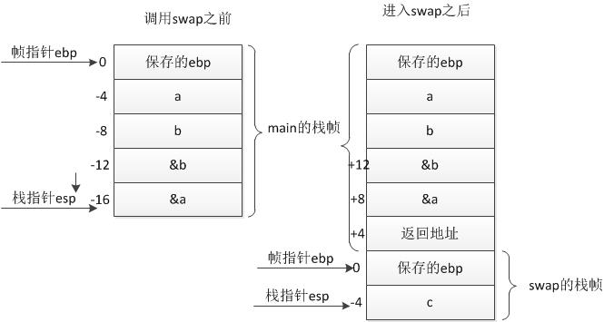

http://blog.csdn.net/jjiss318/article/details/7185802

在Linux内核程序boot/head.s执行完基本初始化操作之后，就会跳转去执行init/main.c程序。函数调用操作包括从一块代码到另一块代码之间的双向数据传递和执行控制转移。数据传递通过函数参数和返回值来进行。另外，我们还需要在进入函数时为函数的局部变量分配存储空间，并且在退出函数时收回这部分空间。Intel 80x86 CPU为控制传递提供了简单的指令，而数据的传递和局部变量存储空间的分配与回收则通过栈操作来实现。

###栈帧结构和控制转移权方式

大多数CPU上的程序实现使用栈来支持函数调用操作。栈被用来**传递函数参数**、**存储返回信息**、**临时保存寄存器原有值以备恢复**以及用来**存储局部数据**。单个函数调用操作所使用的栈部分被称为栈帧（stack frame）结构，其一般结构如图所示。栈帧结构的两端由两个指针来指定。寄存器ebp通常用做帧指针（frame pointer），而esp则用作栈指针（stack pointer）。在函数执行过程中，栈指针esp会随着数据的入栈和出栈而移动，因此函数中对大部分数据的访问都基于帧指针ebp进行。



对于函数A调用函数B的情况，传递给B的参数包含在A的栈帧中。当A调用B时，函数A的返回地址（调用返回后继续执行的指令地址）被压入栈中，栈中该位置也明确指明了A栈帧的结束处。而B的栈帧则从随后的栈部分开始，即图中保存帧指针（ebp）的地方开始。再随后则用于存放任何保存的寄存器值以及函数的临时值。

B函数同样也使用栈来保存不能放在寄存器中的局部变量值。例如由于通常CPU的寄存器数量有限而不能够存放函数的所有局部数据，或者有些局部变量是数组或结构，因此必须使用数组或结构引用来访问。另外，C语言的地址操作符"&"被应用到一个局部变量上时，我们就需要为该变量生成一个地址，即为变量的地址指针分配一空间。最后，B函数会使用栈来保存调用任何其他函数的参数。

栈是往低（小）地址方向扩展的，而esp指向当前栈顶处的元素。通过使用push和pop指令我们可以把数据压入栈中或从栈中弹出。对于没有指定初始值的数据所需要的存储空间，我们可以通过把栈指针递减适当的值来做到。类似地，通过增加栈指针值我们可以回收栈中已分配的空间。
指令CALL和RET用于处理函数调用和返回操作。调用指令CALL的作用是把返回地址压入栈中并且跳转到被调用函数开始处执行。返回地址是程序中紧随调用指令CALL后面一条指令的地址。因此当被调函数返回时就会从该位置继续执行。返回指令RET用于弹出栈顶处的地址并跳转到该地址处。在使用该指令之前，应该先正确处理栈中内容，使得当前栈指针所指位置内容正是先前CALL指令保存的返回地址。另外，若返回值是一个整数或一个指针，那么寄存器eax将被默认用来传递返回值。

尽管某一时刻只有一个函数在执行，但我们还是需要确定在一个函数（调用者）调用其他函数（被调用者）时，被调用者不会修改或覆盖调用者今后要用到的寄存器内容。因此Intel CPU 采用了所有函数必须遵守的寄存器用法统一惯例。该惯例指明，寄存器eax、edx和ecx的内容必须由调用者自己负责保存。当函数B被A调用时，函数B可以在不用保存这些寄存器内容的情况下任意使用它们而不会毁坏函数A所需要的任何数据。另外，寄存器ebx、esi和edi的内容则必须由被调用者B来保护。当被调用者需要使用这些寄存器中的任意一个时，必须首先在栈中保存其内容，并在退出时恢复这些寄存器的内容。因为调用者A（或者一些更高层的函数）并不负责保存这些寄存器内容，但可能在以后的操作中还需要用到原先的值。还有寄存器ebp和esp也必须遵守第二个惯例用法。

###函数调用举例
作为一个例子，我们来观察下面C程序exch.c中函数调用的处理过程。该程序交换两个变量中的值，并返回它们的差值。



```cpp
void swap(int * a, int *b) {
  int c;
  c = *a; *a = *b; *b = c;
}

int main() {
   int a, b;
   a = 16; b = 32;
   swap(&a, &b);
   return (a - b);
}
```

其中函数swap()用于交换两个变量的值。C程序中的主程序main()也是一个函数（将在下面说明），它在调用了swap()之后返回交换后的结果。这两个函数的栈帧结构如图所示。可以看出，函数swap()从调用者main()的栈帧中获取其参数。图中的位置信息相对于寄存器ebp中的帧指针。栈帧左边的数字指出了相对于帧指针的地址偏移值。在像gdb这样的调试器中，这些数值都用2的补码表示。例如，-4被表示成0xFFFFFFFC，-12会被表示成0xFFFFFFF4。

调用者main()的栈帧结构中包括局部变量a和b的存储空间，相对于帧指针位于-4和-8偏移处。由于我们需要为这两个局部变量生成地址，因此它们必须保存在栈中而非简单地存放在寄存器中。

使用命令"gcc -Wall -S -o exch.s exch.c"可以生成该C语言程序的汇编程序exch.s代码，如下所示（删除了几行与讨论无关的伪指令）。

     .text
     _swap:
      pushl %ebp  # 保存原ebp值，设置当前函数的帧指针。
      movl %esp,%ebp
      subl $4,%esp  # 为局部变量c在栈内分配空间。
      movl 8(%ebp),%eax   # 取函数第1个参数，该参数是一个整数类型值的指针。
      movl (%eax),%ecx # 取该指针所指位置的内容，并保存到局部变量c中。
      movl %ecx,-4(%ebp)
      movl 8(%ebp),%eax # 再次取第1个参数，然后取第2个参数。
      movl 12(%ebp),%edx
      movl (%edx),%ecx  # 把第2个参数所指内容放到第1个参数所指的位置。
      movl %ecx,(%eax)
      movl 12(%ebp),%eax   # 再次取第2个参数。
      movl -4(%ebp),%ecx   # 然后把局部变量c中的内容放到这个指针所指位置处。
      movl %ecx,(%eax)
      leave   # 恢复原ebp、esp值（即movl %ebp,%esp; popl %ebp;）。
      ret
     _main:
      pushl %ebp    # 保存原ebp值，设置当前函数的帧指针。
      movl %esp,%ebp
      subl $8,%esp # 为整型局部变量a和b在栈中分配空间。
      movl $16,-4(%ebp) # 为局部变量赋初值（a=16，b=32）。
      movl $32,-8(%ebp)
      leal -8(%ebp),%eax # 为调用swap()函数作准备，取局部变量b的地址，
      pushl %eax # 作为调用的参数并压入栈中。即先压入第2个参数。
      leal -4(%ebp),%eax   # 再取局部变量a的地址，作为第1个参数入栈。
      pushl %eax
      call _swap # 调用函数swap()。
      movl -4(%ebp),%eax # 取第1个局部变量a的值，减去第2个变量b的值。
      subl -8(%ebp),%eax
      leave # 恢复原ebp、esp值（即movl %ebp,%esp; popl %ebp;）。
      ret
 
这两个函数均可以划分成三个部分："设置"，初始化栈帧结构；"主体"，执行函数的实际计算操作；"结束"，恢复栈状态并从函数中返回。对于swap()函数，其设置部分代码是3～5行。前两行用来设置保存调用者的帧指针和设置本函数的栈帧指针，第5行通过把栈指针esp下移4字节为局部变量c分配空间。6～15行是swap函数的主体部分。第6～8行用于取调用者的第1个参数&a，并以该参数作为地址取所存内容到ecx寄存器中，然后保存到为局部变量分配的空间中（-4(%ebp)）。第9～12行用于取第2个参数&b，并以该参数值作为地址取其内容放到第1个参数指定的地址处。第13～15行把保存在临时局部变量c中的值存放到第2个参数指定的地址处。第16～17行是函数结束部分。leave指令用于处理栈内容以准备返回，它的作用等价于下面两个指令：

    movl %ebp,%esp  # 恢复原esp的值（指向栈帧开始处）。
    popl %ebp  # 恢复原ebp的值（通常是调用者的帧指针）。

这部分代码恢复了在进入swap()函数时寄存器esp和ebp的原有值，并执行返回指令ret。

第19～21行是main()函数的设置部分，在保存和重新设置帧指针之后，main()为局部变量a和b在栈中分配了空间。第22～23行为这两个局部变量赋值。从第24～28行可以看出，main()中是如何调用swap()函数的。其中首先使用leal指令（取有效地址）获得变量b和a的地址并分别压入栈中，然后调用swap()函数。变量地址压入栈中的顺序正好与函数申明的参数顺序相反。即函数最后一个参数首先压入栈中，而函数的第1个参数则是最后一个在调用函数指令call之前压入栈中的。第29～30行将两个已经交换过的数字相减，并放在eax寄存器中作为返回值。

从以上分析可知，C语言在调用函数时是在堆栈上临时存放被调函数参数的值，即C语言是传值类语言，没有直接的方法可用来在被调用函数中修改调用者变量的值。因此为了达到修改的目的就需要向函数传递变量的指针（即变量的地址）。
